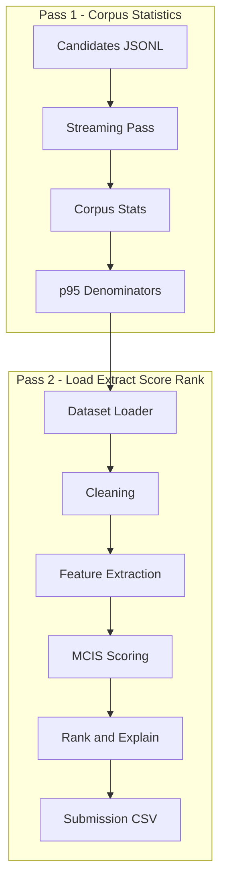
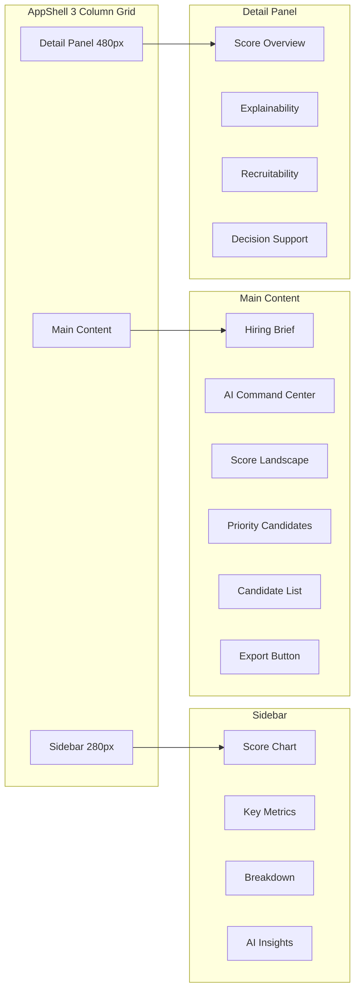

# IntelliRank AI


**IntelliRank AI** is a dual-system platform for explainable AI-powered candidate ranking and intelligent talent discovery. It combines a production-grade Python ranking pipeline (10 intelligence dimensions, streaming 100K-candidate processing) with a fully-interactive React frontend (40+ components, Zustand state management, real-time filtering, Excel export).

[](https://www.typescriptlang.org/)
[](https://react.dev/)
[](https://vite.dev/)
[](https://www.python.org/)
[](https://github.com/pmndrs/zustand)
[](https://www.radix-ui.com/)
[](https://tanstack.com/query)
[](LICENSE)
[](https://playwright.dev/)
[](tests/)
[](.oxlintrc.json)

## Overview

IntelliRank AI addresses critical challenges in technical recruitment through a dual-component architecture:

- **Python Ranking Pipeline** (`intellirank/`) — A streaming, competition-grade AI pipeline that processes 100K+ candidates through 10 intelligence dimensions (Skill, Career, Domain, Experience, Education, Learning, Behavioral, Recruitability, Potential, Profile Quality). Designed for the Redrob AI Hackathon, it generates fully explainable rankings with per-candidate reasoning, pre-flight validated submission CSVs, and 2,900+ lines of pytest coverage across 7 phases.

- **React Frontend** (`src/`) — A feature-rich single-page application with 40+ components, Zustand state management (persisted + slices), TanStack Query data layer, Radix UI primitives, Framer Motion animations, and a custom dual-theme design system (Enterprise Light / Executive Dark). Features include candidate comparison, hidden gems discovery, AI recommendation engine, 7-sheet Excel export, and Playwright-verified responsive layout (768px–2560px).

## Quick Summary

<details open>
<summary><strong>Short (≈50 words)</strong></summary>

Explainable AI candidate ranking platform with a Python pipeline (10 intelligence dimensions, streaming 100K-candidate processing) and a React frontend (40+ components, dual-theme UI, Excel export). Designed for the Redrob AI Hackathon, producing competition-grade rankings with transparent per-candidate reasoning.
</details>

<details>
<summary><strong>Medium (≈100 words)</strong></summary>

Dual-system platform for explainable AI-powered candidate ranking. The Python backend processes 100K+ candidates through a streaming two-pass pipeline, extracting 50+ features across 10 intelligence dimensions using only numpy and pydantic — no GPU or external ML frameworks required. The React frontend provides an interactive dashboard with 40+ components, Zustand state management, TanStack Query data layer, and Radix UI primitives. Features include AI recommendation engine, candidate comparison, hidden gems discovery, and 7-sheet Excel export. Pipeline includes 2,900+ lines of pytest coverage across 7 phases.
</details>

<details>
<summary><strong>Detailed (≈250 words)</strong></summary>

Two independently runnable systems sharing a single repository:

**Python Ranking Pipeline** (`intellirank/`): Streaming, competition-grade pipeline processing 100K+ candidates through two passes — first computing corpus-level normalization statistics, then loading, validating, cleaning (9 operations), and extracting features across 10 intelligence dimensions (Skill with 8 sub-features, Career with 11, Domain with 4, Experience with 5, Education with 3, Learning with 6, Behavioral with 6, Recruitability with 7, Potential with 5, Profile Quality with 5). The MCIS scoring engine computes technical fit via weighted 7-dimension aggregation (SI=0.35, CI=0.20, EI=0.15, DI=0.10, LI=0.10, EDU=0.05, PI=0.05), applies recruitability and quality gates, and filters honeypot anomalies. Explainability decomposes scores into strengths/weaknesses with natural-language reasoning. Output: competition-compliant CSV with pre-flight validation, monotonicity enforcement, and post-write re-validation.

**React Frontend** (`src/`): Single-page application with 40+ components in a 3-column CSS Grid layout. Powered by Zustand (persisted with localStorage + TanStack Query), featuring sortable/filterable candidate lists, explainability panels with dimension breakdowns, recruitability analysis with blocker/signal detection, side-by-side comparison for up to 5 candidates, hidden gems discovery, AI recommendation engine (threshold-based with confidence levels), keyboard shortcuts, dual-theme design system (Enterprise Light / Executive Dark), and 7-sheet Excel export. Responsive from 768px to 2560px, verified with Playwright across 7 viewports.

Architecture decisions: Zustand over Redux (simpler state shape), custom CSS over Tailwind (exact pixel spec), pure Python over ML frameworks (zero GPU dependency). Frontend operates entirely on mock data with no backend dependency.
</details>

## Key Features

### Python Ranking Pipeline

| Feature | Description |
|---------|-------------|
| **10-Dimension Intelligence** | Skill, Career, Domain, Experience, Education, Learning, Behavioral, Recruitability, Potential, and Profile Quality scoring |
| **Explainability Engine** | Per-candidate score decomposition, top-3 strengths/weaknesses, natural-language reasoning with 4 rotating templates |
| **Streaming Architecture** | Two-pass design (corpus stats → load/extract/score/rank) processes 100K+ candidates with O(n) memory |
| **Competition-Grade Output** | Pre-flight validated submission CSVs with monotonicity enforcement, tie-breaking, and post-write re-validation |
| **2900+ Test Coverage** | 7 test phases covering foundation, dataset, cleaning, features, ranking, pipeline, and submission |
| **No External AI Dependencies** | Pure Python — numpy, pydantic, orjson — no TensorFlow/PyTorch/GPU required |

### React Frontend

| Feature | Description |
|---------|-------------|
| **Candidate Ranking UI** | Sortable, filterable list with score bars, skill chips, and dimension breakdowns |
| **Explainability Panel** | Transparent per-candidate scoring rationale with dimension contributions |
| **Recruitability Panel** | Blocker/positive signal analysis with timeline risk assessment |
| **Hidden Gems Discovery** | Identifies undervalued candidates with high potential scores |
| **Candidate Comparison** | Side-by-side analysis for up to 5 candidates across all dimensions |
| **Decision Support** | Automated strength/concern/suggestion analysis with interview guidance |
| **AI Recommendation Engine** | Threshold-based screening (Strong Hire / Recommended / Consider) with confidence levels |
| **7-Sheet Excel Export** | Full workbook with rankings, strong hires, hidden gems, comparison, analytics, feature analysis, and insights |
| **Keyboard-First UX** | Navigable via keyboard shortcuts with ⌘K command palette |
| **Dual-Theme Design System** | Enterprise Light and Executive Dark themes |

## System Architecture

IntelliRank AI consists of two independently runnable systems sharing a single repository.

### Python Ranking Pipeline



**Pipeline modules:**

| Stage | Module | Key Operations |
|-------|--------|----------------|
| 1. Corpus Statistics | `features/corpus_stats.py` | Single-pass p95 percentile computation |
| 2. Dataset Loading | `dataset/reader.py`, `loader.py` | Streaming orjson JSONL parser, structural validation |
| 3. Cleaning | `cleaning/pipeline.py` | Salary normalization, date validation, YOE cross-validation, text preprocessing, boilerplate detection, company classification |
| 4. Feature Extraction | `features/extractor.py` | 10 dimension modules orchestrated in dependency-safe order |
| 5. Scoring | `ranking/scorer.py` | MCIS-01–07: technical fit, recruitability gate, quality modifier, honeypot gate, clip |
| 6. Ranking | `ranking/ranker.py` | Sort, top-k, monotonicity enforcement |
| 7. Explainability | `ranking/explainability.py` | Score decomposition, strengths/weaknesses, 1-2 sentence reasoning |
| 8. Submission | `submission.py` | Pre-flight validation, CSV write, post-write re-validation |

### React Frontend



**Global layers:** Toast notifications, KeyboardShortcuts, UXAudit overlay

### Architecture Decisions

| Decision | Rationale |
|----------|-----------|
| **Dual-system monorepo** | Python pipeline processes 100K candidates offline; React FE renders results from mock data with no backend dependency |
| **Zustand over Redux** | State shape (~50 fields) well-served by Zustand's simplicity; persist middleware handles localStorage sync |
| **TanStack Query** | Caching, deduplication, loading/error states for the single `/api/rankings` call |
| **Custom CSS over Tailwind** | Design spec specifies exact pixel values (48px rows, 56px header, 280px sidebar) — custom CSS avoids arbitrary-value class bloat |
| **No external ML dependencies** | Pure numpy/pydantic feature engineering — no GPU, TensorFlow, or PyTorch needed |
| **Streaming two-pass design** | Corpus stats in one pass (O(n) memory); extract/score/rank in second pass — handles 100K+ candidates on commodity hardware |
| **CSS Grid over Flexbox** | Three-column layout (sidebar + content + overlay) maps naturally to `grid-template-columns: 280px 1fr` with panel as absolute overlay |
| **Pydantic v2 for data models** | 18 validated models with zero-cost serialization; strict mode for competition-grade data integrity |

## Engineering Challenges & Tradeoffs

### Data: Processing 100K+ Candidates Without Loading Into Memory

The Redrob dataset is a 465MB JSONL file with 100K+ candidate profiles. Loading it entirely into memory would consume ~2GB+ after Pydantic parsing.

**Solution:** Two-pass streaming architecture. Pass 1 reads raw JSONL with orjson (zero-copy parsing) to compute corpus-level normalization statistics — O(n) memory regardless of file size. Pass 2 streams again through the same file, parse → clean → extract → score → rank in a single pipeline, yielding only the top-100 results. The `iter_candidates()` generator never holds more than one candidate in memory at a time.

### Feature Engineering: 10 Dimensions Without External ML

Most recruitment AI systems rely on embedding models (BERT, Sentence Transformers) for semantic matching. These require GPU infrastructure and introduce opacity in scoring.

**Solution:** Pure feature-engineered scoring using hand-crafted signals across 10 dimensions (50+ individual features). Skill Intelligence uses a 24K-line taxonomy of Tier-1/Tier-2/Tier-3 skills with weighted term scanning. Career Intelligence detects consulting vs product experience, AI description specificity, and production deployment evidence through regex patterns and company name normalization — no neural network required. This makes every score fully deterministic and explainable.

### Explainability: MCIS Scoring With Honesty Rules

Generating natural-language reasoning that doesn't hallucinate is a well-known AI safety problem.

**Solution:** Template-based reasoning (MCIS-06) with strict honesty rules: only emit signals actually detected during feature extraction. Tier-1 skills are pulled from a detected set, not generated. Notice periods, inactivity days, and anomaly scores are mandatory disclosures. Four rotating opening templates prevent identical phrasing across candidates while keeping every word grounded in extracted data.

### State Management: Zustand vs Redux vs Context

The app has ~50 state fields spanning rankings, hidden gems, distribution, selection, comparison, filters, sort, pagination, view modes, and UI state.

**Why Zustand:** Context would cause unnecessary re-renders across the 40+ component tree. Redux would require ~3× boilerplate for a state shape that's fundamentally flat. Zustand's `create` + `persist` middleware delivers typed state with localStorage sync in ~200 lines. Selector hooks (`useSelectedCandidate`, `useDistribution`) keep re-renders scoped to components that actually consume each slice.

### CSS: Custom Design System vs Tailwind

The UX spec defined exact pixel values: 48px candidate rows, 56px header, 280px sidebar, 480px panel width, 3-column grid at ≥1440px with sidebar collapsing to 48px icon-only at 1280px.

**Why not Tailwind:** Mapping these exact values to Tailwind would require arbitrary-value classes (`w-[280px]`, `h-[56px]`) — essentially inline styles with extra syntax. A custom CSS design system (~2000 lines in `index.css`) with CSS custom properties (`--sidebar-width: 280px`, `--header-height: 56px`) makes the spec values a single point of change and keeps component CSS focused on layout, not pixel math.

### Export: 7-Sheet Excel Without Server Infrastructure

The spec required structured data export with styled cells, merged headers, and banded rows — typically a server-side job.

**Solution:** Client-side export using `xlsx-js-style`. The `export.ts` file (~1500 lines) programmatically builds a 7-sheet workbook using the same mock data the UI renders. No API calls, no server processing, no file size limits. Each sheet (Rankings, Strong Hires, Hidden Gems, Comparison, Analytics, Feature Analysis, Insights) applies its own column widths, header styling, and conditional formatting.

### Testing: 7-Phase Pytest Suite Without Mocking

The pipeline has no external dependencies (databases, APIs, ML models) — every test runs against pure Python data transformations.

**Strategy:** Each of the 7 test phases builds on the previous phase's outputs. Phase 1 tests foundation utilities (math, text, date). Phase 2 validates the dataset reader against known-format fixtures. Phase 3 tests cleaning transformations with edge cases (missing dates, malformed salaries). Phases 4–5 test feature extraction and scoring with sample candidates. Phase 6 runs the full pipeline end-to-end. Phase 7 validates the submission CSV against official competition rules — no mocking required at any layer.

## Technology Stack

### Frontend

| Technology | Version | Description |
|------------|---------|-------------|
| React | 19.2 | Component library |
| TypeScript | 6.0 | Type safety |
| Vite | 8.1 | Build tool & dev server |
| Zustand | 5.0 | State management (persist middleware) |
| TanStack Query | 5.101 | Data fetching & caching |
| TanStack Query Devtools | 5.101 | Development debugging |
| Radix UI Themes | 3.3 | Accessible component primitives |
| Framer Motion | 12.42 | Animation library |
| React Router | 6.30 | Client-side routing |
| Lucide React | 1.22 | Icon library |
| xlsx-js-style | 1.2 | Excel export (7-sheet workbook) |
| clsx | 2.1 | Conditional class merging |
| @fontsource/inter | 5.2 | Inter font (body) |
| @fontsource/jetbrains-mono | 5.2 | JetBrains Mono font (code) |

### Python Pipeline

| Technology | Version | Description |
|------------|---------|-------------|
| Python | 3.12 | Pipeline language |
| Pydantic | 2.0+ | Data models & validation |
| orjson | 3.9+ | Fast JSONL parsing |
| NumPy | 1.26+ | Numerical computations |
| PyArrow | 14.0+ | Data interchange |
| Rich | 13.0+ | Terminal logging |
| tqdm | 4.66+ | Progress bars |
| setuptools | 72+ | Build backend |

### Testing

| Technology | Description |
|------------|-------------|
| pytest 8.0+ | Python testing (7 phases, 2,900+ lines) |
| pytest-cov 5.0+ | Python coverage reporting |
| Playwright 1.61 | Frontend E2E verification |
| Oxlint 1.71 | TypeScript linting |

### Tooling

| Technology | Description |
|------------|-------------|
| TypeScript 6.0 | Strict mode enabled |
| Vite 8.1 | Fast HMR, TypeScript-native |
| Oxlint | Type-aware linting (React + TS + OXC rules) |
| Prettier | Code formatting (single quotes, trailing commas) |

## Folder Structure

```
IntelliRank-AI/
├── intellirank/                 # Python ranking pipeline
│   ├── cleaning/               # 9 DC-CLEAN operations
│   ├── dataset/                # Streaming JSONL reader & validator
│   ├── features/               # 10 intelligence dimension extractors
│   │   ├── skill_intelligence.py
│   │   ├── career_intelligence.py
│   │   ├── domain_intelligence.py
│   │   ├── experience_intelligence.py
│   │   ├── education_intelligence.py
│   │   ├── learning_intelligence.py
│   │   ├── behavioral_intelligence.py
│   │   ├── recruitability.py
│   │   ├── candidate_potential.py
│   │   ├── profile_quality.py
│   │   ├── corpus_stats.py     # p95 normalization denominators
│   │   └── extractor.py        # Feature orchestrator
│   ├── ranking/                # MCIS scoring + ranking + explainability
│   ├── config.py               # PipelineConfig dataclass
│   ├── constants.py            # Skill taxonomy, weights, breakpoints
│   ├── pipeline.py             # End-to-end pipeline orchestrator
│   ├── submission.py           # Competition CSV generator & validator
│   ├── types.py                # 18 Pydantic v2 data models
│   ├── utils/                  # Math, text, date utilities
│   ├── logger.py               # Structured logging
│   └── __init__.py
├── src/                        # React frontend
│   ├── api/                    # API client (fetch wrapper)
│   ├── components/             # UI components (40+)
│   │   ├── layout/            # AppShell, Header, Sidebar
│   │   ├── workspace/         # CandidateWorkspace, CandidateList, etc.
│   │   ├── sidebar/           # ScoreDistributionChart, KeyMetrics, AiInsights
│   │   ├── ui/                # ThemeToggle, Toast, Loading, KeyboardShortcuts
│   │   ├── DecisionSupport/   # StrengthCard, SuggestionCard, etc.
│   │   ├── ComparisonView.tsx
│   │   ├── DetailPanel.tsx
│   │   ├── ExplainabilityPanel.tsx
│   │   ├── HiddenGemsView.tsx
│   │   ├── RecruitabilityPanel.tsx
│   │   └── DecisionSupport.tsx
│   ├── hooks/                  # useCandidates, useFilteredCandidates, etc.
│   ├── intellirank/            # AI recommendation engine + enrichment
│   ├── lib/                    # Excel export engine (7-sheet workbook)
│   ├── mocks/                  # 100 mock candidates + recruitability data
│   ├── store/                  # Zustand stores (useAppStore, useToastStore)
│   ├── types/                  # TypeScript interfaces (api.ts, store.ts)
│   ├── App.tsx                 # Root component
│   ├── main.tsx                # Entry point (React 19 + TanStack Query)
│   └── index.css               # Custom dual-theme design system (~2000 lines)
├── tests/                      # Python test suite (7 phases)
│   ├── test_phase1_foundation.py
│   ├── test_phase2_dataset.py
│   ├── test_phase3_cleaning.py
│   ├── test_phase4_features.py
│   ├── test_phase5_ranking.py
│   ├── test_phase6_pipeline.py
│   └── test_phase7_submission.py
├── docs/                       # Architecture & design documentation
│   ├── ARCHITECTURE.md
│   ├── DATASET_ANALYSIS.md
│   └── FEATURE_ENGINEERING.md
├── public/                     # Static assets
│   └── favicon.svg
├── output/                     # Generated submission CSVs
├── redrob_dataset/             # Dataset (gitignored, not included)
├── verify_intellirank.mjs      # Playwright: candidate table verification
├── verify_layout_arch.mjs      # Playwright: layout architecture verification
├── verify_responsive.mjs       # Playwright: responsive design test (7 viewports)
├── package.json                # Frontend dependencies (React, etc.)
├── pyproject.toml              # Python dependencies (pydantic, numpy, etc.)
├── tsconfig.json               # TypeScript configuration
├── vite.config.ts              # Vite configuration (aliases)
├── .oxlintrc.json              # Oxlint linting rules
├── .prettierrc                 # Prettier formatting config
└── .gitignore                  # Git ignore rules
```

## Installation

### Prerequisites

- **Node.js** 18+ (for frontend)
- **Python** 3.12+ (for pipeline)

### Clone

```bash
git clone https://github.com/IntelliRank-AI/intellirank.git
cd intellirank
```

### Frontend Setup

```bash
# Install JavaScript dependencies
npm install

# Start dev server (default: http://localhost:5173)
npm run dev
```

The frontend runs entirely on mock data with no backend dependency. It will be available at `http://localhost:5173` (or the next available port).

### Python Pipeline Setup

```bash
# Create and activate a virtual environment (recommended)
python -m venv .venv
.venv\Scripts\activate  # Windows
# source .venv/bin/activate  # macOS/Linux

# Install dependencies
pip install -e ".[dev]"

# Run tests
pytest
```

### Dataset

The pipeline expects the Redrob AI Hackathon dataset at `redrob_dataset/challenge_dataset/India_runs_data_and_ai_challenge/candidates.jsonl`. This dataset is **not included** in the repository (see `.gitignore`). You can obtain it from the [Redrob AI Hackathon](https://redrob.ai/hackathon).

To run the pipeline on your dataset:

```bash
python -c "
from intellirank.pipeline import run_pipeline
from pathlib import Path
result = run_pipeline(Path('redrob_dataset/challenge_dataset/India_runs_data_and_ai_challenge/candidates.jsonl'))
print(f'Ranked {len(result.ranked)} candidates in {result.elapsed_seconds:.1f}s')
"
```

### Environment Variables

The pipeline accepts a single optional environment variable:

| Variable | Default | Description |
|----------|---------|-------------|
| `INTELLIRANK_LOG_LEVEL` | `INFO` | Logging level (`DEBUG`, `INFO`, `WARNING`, `ERROR`) |

The frontend accepts one optional variable (for future backend integration):

| Variable | Default | Description |
|----------|---------|-------------|
| `VITE_API_URL` | `http://localhost:8000` | Backend API base URL |

> **Note:** The frontend operates entirely on mock data. No database, API server, or external services are required to run it.

## Usage

### Frontend Workflow

1. **View Ranked Candidates** — The dashboard loads 100 mock candidates with AI-generated scores, dimension breakdowns, and tier classifications (Strong Hire / Good Fit / Possible / Weak).

2. **Filter and Sort** — Use the FilterBar to narrow by score range, location, tier, availability, or experience. Toggle sort by rank, score, skill fit, recruitability, experience, or potential.

3. **Inspect a Candidate** — Click any row to open the Detail Panel:
   - **Score Overview** — Gauge with overall score and verdict label
   - **Explainability** — Dimension scores with weight contributions and reasoning
   - **Recruitability** — Blocker analysis, positive signals, timeline risks
   - **Decision Support** — Strengths, concerns, suggestions, interview guidance

4. **Compare Candidates** — Select up to 5 candidates for side-by-side comparison across all dimensions.

5. **Discover Hidden Gems** — Toggle to the Hidden Gems view to see undervalued candidates with high potential scores.

6. **Export to Excel** — Click "Export" to generate a 7-sheet workbook (Rankings, Strong Hires, Hidden Gems, Comparison, Analytics, Feature Analysis, Insights).

### Python Pipeline Workflow

1. **Prepare Dataset** — Place the Redrob challenge dataset at the expected path.

2. **Run Pipeline** — Call `run_pipeline()` from `intellirank/pipeline.py`. The system:
   - Streams through all candidates in two passes
   - Computes corpus-level statistics (p95 denominators)
   - Cleans and validates each candidate (9 operations)
   - Extracts 50+ features across 10 intelligence dimensions
   - Scores, ranks, and generates explainability for top-100

3. **Generate Submission** — The pipeline outputs a competition-compliant CSV with pre-flight validation, monotonicity enforcement, and post-write re-validation.

### Frontend AI Engine

The frontend includes a client-side AI recommendation engine (`src/intellirank/aiEngine.ts`) that evaluates candidates using configurable score thresholds:

| Threshold | Recommendation |
|-----------|---------------|
| ≥ 88 | Strong Hire |
| ≥ 75 | Recommended |
| ≥ 62 | Consider |
| ≥ 50 | Low Priority |
| < 50 | Pass |

Additional outputs include confidence levels, top strengths, potential risks, executive summaries, and global pipeline insights.

## Testing

### Python Pipeline (2,900+ lines across 7 phases)

```bash
# Run all tests
pytest

# Run specific phase
pytest tests/test_phase5_ranking.py -v

# Run with coverage
pytest --cov=intellirank --cov-report=term
```

| Phase | File | Coverage |
|-------|------|----------|
| Foundation | `test_phase1_foundation.py` | Config, constants, math/text/date utils |
| Dataset | `test_phase2_dataset.py` | Validator, JSONL reader, loader, Pydantic models |
| Cleaning | `test_phase3_cleaning.py` | All 9 DC-CLEAN operations |
| Features | `test_phase4_features.py` | All 10 dimension modules, corpus stats |
| Ranking | `test_phase5_ranking.py` | MCIS scoring, ranking, reasoning, explainability |
| Pipeline | `test_phase6_pipeline.py` | Full pipeline, edge cases, determinism |
| Submission | `test_phase7_submission.py` | CSV generation, preflight, competition rules |

### Frontend Verification (Playwright)

```bash
# TypeScript type checking
npm run typecheck

# Linting
npm run lint

# Build production bundle
npm run build

# Start dev server, then run verification scripts (in separate terminal):
node verify_intellirank.mjs
node verify_layout_arch.mjs
node verify_responsive.mjs
```

The Playwright scripts verify candidate table presence, AI Command Center, Score Landscape, Priority Candidates, keyboard navigation hint, narrative strip, detail panel rendering (verdict, score, gauge), layout architecture (document flow, explorer bounded scroll, panel positioning), and responsive behavior across 7 viewports (768px–2560px).

## Accessibility

The frontend includes several accessibility-focused features:

| Feature | Implementation |
|---------|---------------|
| **Keyboard Navigation** | Custom keyboard shortcuts with ⌘K search hint; shortcuts disabled when `input`/`textarea` focused |
| **Theme Support** | Respects `prefers-color-scheme` for dark/light mode; manual toggle via `ThemeToggle` |
| **Reduced Motion** | Respects `prefers-reduced-motion` media query |
| **Radix UI Primitives** | All interactive components use Radix UI, which provides ARIA attributes, focus management, and keyboard support out of the box |
| **Semantic HTML** | Proper heading hierarchy, landmarks, and focus indicators |

> **Note:** While designed with accessibility in mind, formal WCAG 2.1 AA compliance testing has not been completed.

## Roadmap

### Near Term

- [ ] **Frontend–Pipeline Integration** — Connect the React frontend to the Python pipeline via a lightweight API layer, replacing mock data with real rankings
- [ ] **CI/CD Pipeline** — Add GitHub Actions for automated type checking, linting, testing, and build on every PR
- [ ] **Docker Compose** — Containerized development environment for the full stack
- [ ] **Live Demo Deployment** — Deploy the frontend to Vercel/Netlify with static mock data

### Medium Term

- [ ] **Additional Intelligence Dimensions** — Expand beyond 10 dimensions with team/culture fit scoring
- [ ] **Configurable Scoring Weights** — Allow recruiters to customize MCIS weight profiles
- [ ] **Dataset Explorer** — Add file upload and interactive dataset browsing to the frontend
- [ ] **Integration Tests** — End-to-end tests connecting pipeline output to frontend rendering

### Longer Term

- [ ] **Real-time Collaboration** — Multi-user sessions for team-based candidate evaluation
- [ ] **Pluggable ML Models** — Support for embedding-based semantic matching alongside the existing feature-engineered approach

## Contributing

### Development Setup

1. Fork the repository
2. Create a feature branch (`git checkout -b feat/your-feature`)
3. Follow existing code conventions (Prettier + Oxlint for frontend, PEP 8 for Python)
4. Add tests for new functionality
5. Run linting and type checking: `npm run lint && npm run typecheck`
6. Run Python tests: `pytest`
7. Submit a pull request

### Code Quality Guidelines

- **TypeScript**: Strict mode enabled; use TypeScript 6.0 features
- **Python**: Type-annotated with Pyright strict mode; use Pydantic v2 models
- **Formatting**: Prettier (single quotes, trailing commas, 100 print width)
- **Linting**: Oxlint with React + TypeScript + OXC rules
- **Testing**: pytest for Python, Playwright for frontend E2E verification
- **Feature additions**: Add corresponding tests and update feature documentation

## License

MIT License — see [LICENSE](LICENSE).

## Author

### Poulabi Ghosh

[](https://github.com/poulabighosh)
[](https://linkedin.com/in/poulabighosh)

**Software Engineer · AI/ML Engineer · Full-Stack Developer**

Email: [poulabighosh44@gmail.com](mailto:poulabighosh44@gmail.com)

IntelliRank AI was built as a Redrob AI Hackathon submission to demonstrate production-quality engineering across the full stack — from streaming data pipelines and deterministic feature engineering to interactive React UIs with real-time filtering and complex state management.

---

## Acknowledgements

**Core Technologies** — React 19, TypeScript 6, Vite 8, Zustand, TanStack Query, Radix UI, Python 3.12, Pydantic v2, NumPy, pytest, Playwright

**Build & Tooling** — Oxlint, Prettier, Vite

**Design & Inspiration** — Redrob AI Hackathon (competition dataset and problem formulation), Radix UI (accessible primitives), shadcn/ui, Vercel, Supabase (UX pattern inspiration)
